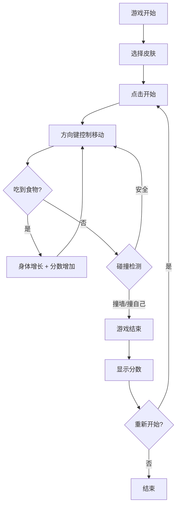

# 贪吃蛇游戏 - 产品需求文档

## 1. 产品概述
一款经典的贪吃蛇网页游戏，提供流畅的游戏体验和精美的视觉效果。玩家通过方向键控制蛇的移动，收集食物获得分数，挑战自己的最高记录。
- 目标用户：休闲游戏爱好者、怀旧玩家
- 产品价值：提供简单有趣的游戏体验，锻炼反应能力

## 2. 核心功能

### 2.1 功能模块
1. **游戏主界面**：游戏区域、分数显示、皮肤选择、控制按钮
2. **游戏控制**：方向键控制、暂停/继续、重新开始

### 2.2 页面详情
| 页面名称 | 模块名称 | 功能描述 |
|---------|---------|---------|
| 游戏主界面 | 游戏区域 | Canvas 绘制蛇和食物，蛇头显示"王"字标识 |
| 游戏主界面 | 分数面板 | 实时显示当前分数和最高分 |
| 游戏主界面 | 皮肤选择 | 三种颜色皮肤可选（经典绿、炫酷蓝、热情红） |
| 游戏主界面 | 控制面板 | 开始/暂停按钮、重新开始按钮 |

## 3. 核心流程
玩家打开游戏 → 选择喜欢的皮肤颜色 → 点击开始游戏 → 使用方向键控制蛇移动 → 吃到食物身体增长、分数增加 → 撞墙或撞到自己游戏结束 → 显示最终分数 → 可重新开始

## 4. 用户界面设计

### 4.1 设计风格
- **主色调**：深色背景（#1a1a2e）配合霓虹风格的游戏元素
- **辅助色**：三种皮肤颜色 - 翡翠绿(#00d26a)、电光蓝(#00b4d8)、烈焰红(#ff4757)
- **按钮风格**：圆角按钮，带有发光效果和悬停动画
- **字体**：游戏标题使用粗体显示字体，分数使用等宽字体
- **布局**：居中布局，游戏区域为正方形 Canvas
- **特效**：蛇身渐变色、食物发光效果、得分动画

### 4.2 页面设计概览
| 页面名称 | 模块名称 | UI 元素 |
|---------|---------|---------|
| 游戏主界面 | 游戏区域 | 600x600 Canvas，网格背景，蛇和食物渲染 |
| 游戏主界面 | 分数面板 | 当前分数（大号字体）、最高分（小号字体） |
| 游戏主界面 | 皮肤选择 | 三个圆形色块按钮，选中状态高亮 |
| 游戏主界面 | 控制面板 | 开始/暂停按钮、重新开始按钮 |

### 4.3 响应式设计
- 桌面优先设计，游戏区域固定 600x600 像素
- 移动端适配：游戏区域根据屏幕宽度自适应缩放
- 支持键盘方向键和触屏滑动操作

## 5. 游戏规则
1. 蛇初始长度为 3 节，向右移动
2. 每吃到一个食物，蛇身增加 1 节，分数增加 10 分
3. 食物随机生成在空白位置
4. 蛇头撞到边界或自身任意一节，游戏结束
5. 蛇头始终显示"王"字标识，跟随蛇头移动
6. 游戏速度固定为每 100ms 移动一格
