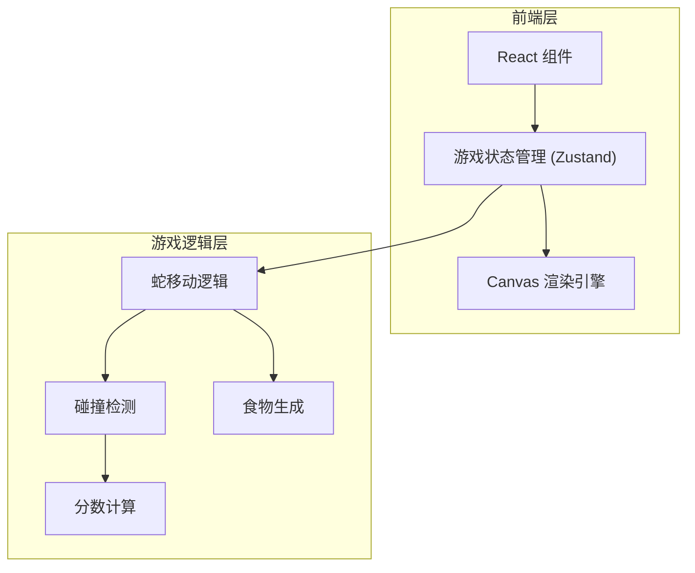

# 贪吃蛇游戏 - 技术架构文档

## 1. 架构设计
纯前端单页应用，使用 React + TypeScript + Canvas 实现游戏逻辑和渲染。



## 2. 技术说明
- **前端框架**：React 18 + TypeScript
- **样式方案**：Tailwind CSS 3
- **构建工具**：Vite
- **状态管理**：Zustand
- **渲染方式**：Canvas 2D API

## 3. 路由定义
| 路由 | 用途 |
|-----|-----|
| / | 游戏主页面 |

## 4. 数据模型

### 4.1 游戏状态
```typescript
interface Position {
  x: number;
  y: number;
}

interface GameState {
  snake: Position[];           // 蛇身体坐标数组，索引0为蛇头
  food: Position;              // 食物坐标
  direction: Direction;        // 当前移动方向
  score: number;               // 当前分数
  highScore: number;           // 最高分（localStorage存储）
  isPlaying: boolean;          // 游戏是否进行中
  isPaused: boolean;           // 是否暂停
  skinColor: SkinColor;        // 当前皮肤颜色
}

type Direction = 'UP' | 'DOWN' | 'LEFT' | 'RIGHT';
type SkinColor = 'green' | 'blue' | 'red';
```

### 4.2 游戏配置
```typescript
const GAME_CONFIG = {
  GRID_SIZE: 20,              // 网格大小 20x20
  CELL_SIZE: 30,              // 每格像素大小 30px
  CANVAS_SIZE: 600,           // Canvas 尺寸 600x600
  GAME_SPEED: 100,            // 游戏速度 100ms/帧
  INITIAL_SNAKE_LENGTH: 3,    // 初始蛇长度
  SCORE_PER_FOOD: 10,         // 每个食物得分
};
```

## 5. 核心算法

### 5.1 蛇移动算法
```
1. 根据当前方向计算新的蛇头位置
2. 将新位置添加到蛇数组头部
3. 如果吃到食物：不移除尾部，生成新食物
4. 如果没吃到食物：移除蛇数组尾部
```

### 5.2 碰撞检测算法
```
1. 检查蛇头是否超出边界（x < 0 或 x >= GRID_SIZE 或 y < 0 或 y >= GRID_SIZE）
2. 检查蛇头是否与自身碰撞（蛇头坐标是否在蛇身数组中重复出现）
3. 任一条件满足则游戏结束
```

### 5.3 食物生成算法
```
1. 生成随机坐标 (x, y)
2. 检查该坐标是否与蛇身重叠
3. 如果重叠则重新生成，直到找到空白位置
```

## 6. 渲染设计

### 6.1 Canvas 渲染流程
1. 清空画布
2. 绘制网格背景
3. 绘制食物（带发光效果）
4. 绘制蛇身（渐变色效果）
5. 在蛇头位置绘制"王"字标识

### 6.2 皮肤颜色定义
```typescript
const SKIN_COLORS = {
  green: {
    head: '#00ff88',
    body: '#00d26a',
    glow: 'rgba(0, 210, 106, 0.5)',
  },
  blue: {
    head: '#00d4ff',
    body: '#00b4d8',
    glow: 'rgba(0, 180, 216, 0.5)',
  },
  red: {
    head: '#ff6b7a',
    body: '#ff4757',
    glow: 'rgba(255, 71, 87, 0.5)',
  },
};
```

## 7. 项目结构
```
src/
├── components/
│   ├── GameCanvas.tsx      # Canvas 游戏渲染组件
│   ├── ScorePanel.tsx      # 分数面板组件
│   ├── SkinSelector.tsx    # 皮肤选择组件
│   └── ControlPanel.tsx    # 控制按钮组件
├── hooks/
│   └── useGameLoop.ts      # 游戏循环 Hook
├── store/
│   └── gameStore.ts        # Zustand 游戏状态管理
├── utils/
│   └── gameLogic.ts        # 游戏核心逻辑函数
├── pages/
│   └── Game.tsx            # 游戏主页面
├── types/
│   └── game.ts             # TypeScript 类型定义
└── App.tsx                 # 应用入口
```
